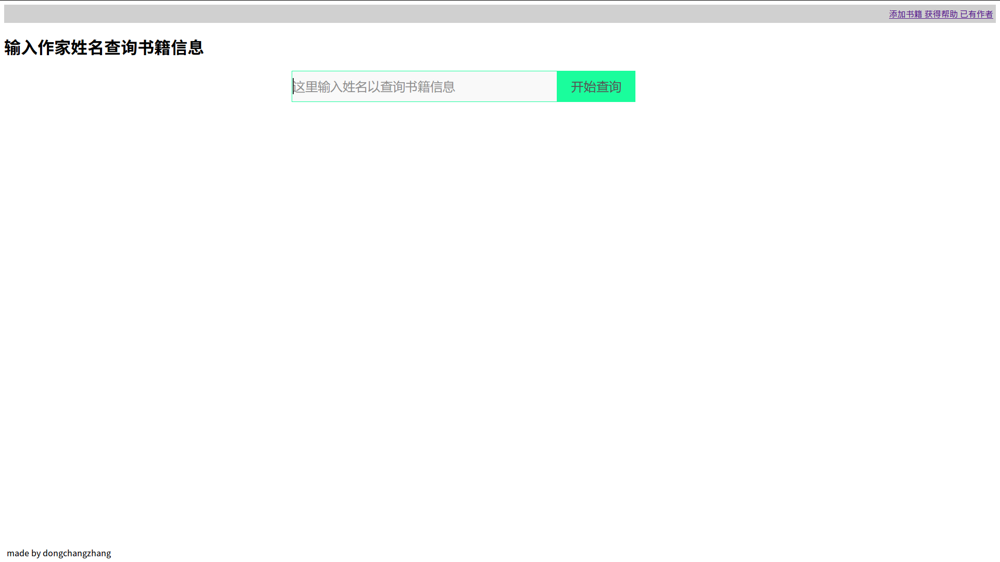
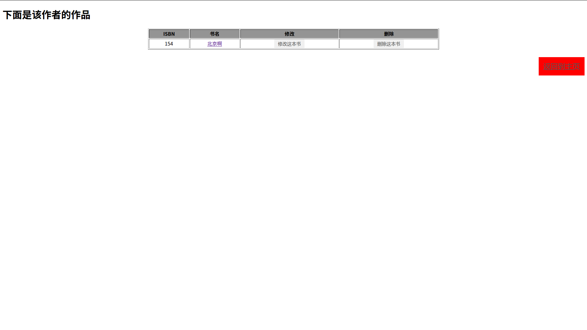
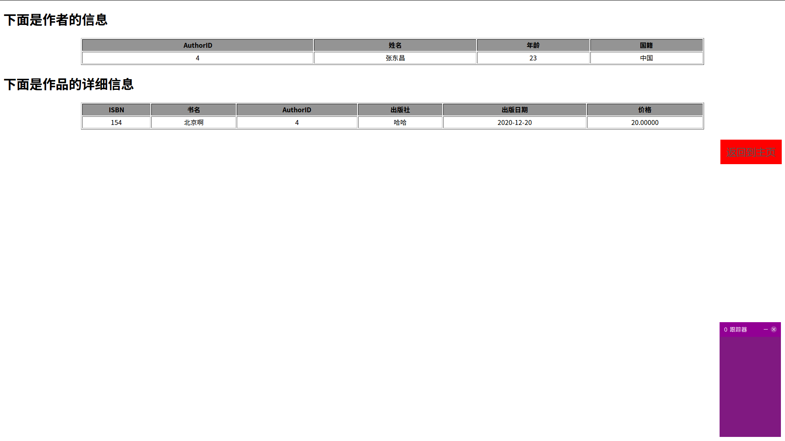
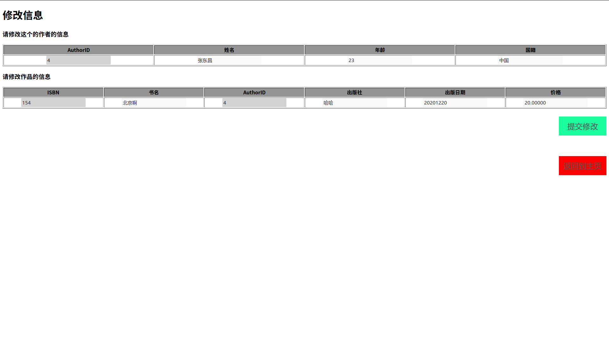
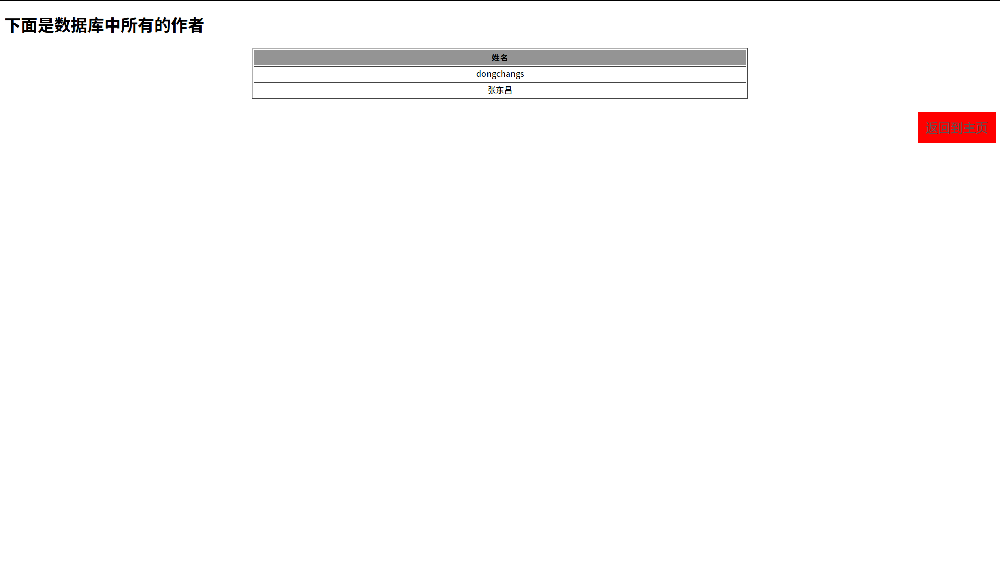
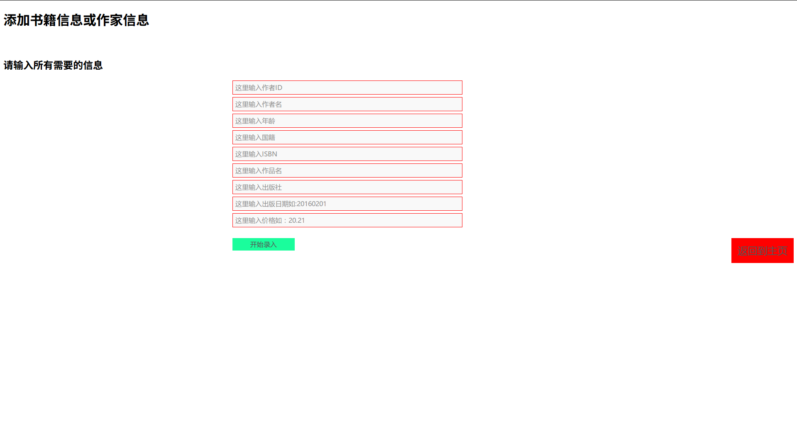

# 在线图书管理

### 前言

这是软件工程的第二个实验，目的在于学习MVC开发模式以及了解利用struts2框架搭建网站的过程。

开发环境：ubuntu16.04，
CreateBookDB.md中包括了数据库创建的所有命令，也可以在这里查看数据结构

[环境配置请阅读我的配置博客](http://blog.csdn.net/dongchangzhang/article/details/52658328)

### 效果

项目主页

查询结果

查看信息

编辑信息

查看已有作者

添加书籍

查看帮助

